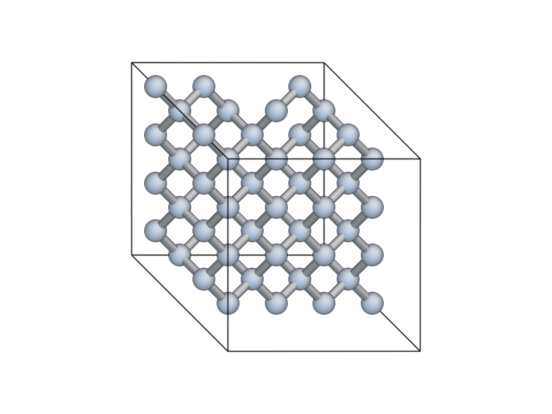

# AtomEye 

Original version (c) Ju Li. 
See <http://mt.seas.upenn.edu/Archive/Graphics/A> for details.

Modifications to read XYZ and NetCDF files and add Python interface
(c) James Kermode 2008-2015 <J.R.Kermode@warwick.ac.uk>. See below for more details of the new features.

## Installation

You'll need to edit Makefile.config for your system, and then run
`make` to build a binary or `make atomeyelib` to build a library.

If you want to compile both targets, it's very important that you do a
`make clean` in between building the standalone binary and the library.

If you are a [QUIP](https://github.com/libAtoms/QUIP) user, set the `QUIP_ARCH` and `QUIP_ROOT` environment variables appropriately. This will use your QUIP Makefiles to determine the
compiler, flags and libraries needed. You can then run `make` or 
`make atomeyelib` as above.

## Binaries

Some (unsupported!) binary exectuable, mostly for recent Mac OS X version
are available from 

<https://www.dropbox.com/sh/n5fzlze6fgh4pqo/AAATTvEDiPM6ujD5SbG85-97a?dl=0>

## Python extension module

See the `Python/` subdirectory for a Python extension module which
links to the `atomeyelib` library. Build and install with `python setup.py install` from inside this subdirectory.

The module exports a viewer class, `atomeye.AtomEyeViewer` and a convenience 
function `atomeye.view()`. Both can be used to visualise with 
[ASE](https://wiki.fysik.dtu.dk/ase/)-compatible `Atoms` objects.

Full documentation for the Python interface is
available at <http://libatoms.github.io/QUIP/atomeye.html>

## Jupyter notebooks

The `atomeye` Python extension module can be used within 
[Jupyter](https://jupyter.org/) notebooks to pop open a viewer window and embed snapshots in the notebook (inspired by [iPyMol](https://github.com/cxhernandez/ipymol)).

    from ase.lattice import bulk
    at = bulk("Si")
    at *= (4, 4, 1)
    del at[len(at)/2]

    import atomeye
    v = atomeye.view(at)
    v.display()

## Enhancements to standard AtomEye

### NetCDF and Extended XYZ Support

[NetCDF](http://jrkermode.co.uk/quippy/io.html#netcdf) files with a `.nc` extension and [Extended XYZ](http://jrkermode.co.uk/quippy/io.html#extendedxyz) files with a `.xyz` extension are supported.

The atom species is inferred from either a `species` property if present, or from atomic numbers in `Z` if not. Masses are read from the `mass` property if it exists, otherwise they default to the periodic table values. Real and integer properties are loaded as auxiliary properties. Vector fields are mapped to a triplet of auxiliary properties with names like `force0`, `force1` and `force2`.

You can step through the frames in the trajectory files as normal (insert/delete for forward/backward, ctrl+insert/ctrl+delete for first/last frame), or got to a particular frame by appending :frame_number to the filename:

    load_config traj.nc:first
    load_config traj.nc:last
    load_config traj.nc:forward
    load_config traj.nc:backward
    load_config traj.nc:45          # go to frame 45
    load_config traj.nc:forward:10  # go forward 10 frames
    set n->glob_advance 100         # change default increment to 100

These options also work from the command line, e.g.::

    A traj.nc:last  # open traj.nc in AtomEye and display the last frame
    A traj.nc:340 # show frame 340

Reloading the configuration (`reload_config`, or press F10) will close and reopen the file, so if the simulation is currently running this will give access to the new frames.

Since XYZ files are text-based, it's hard to efficiently seek to a particular frame. We create an index file (with extension `.xyz.idx`) the first time you load an XYZ file into AtomEye. This takes a little while to generate as we have to go through the whole file and identify where each new frame starts. If the XYZ file later gets bigger (e.g. because the simulation is still running), then the `.idx` file is updated without having to rebuild it from scratch.

### New command ``draw_arrows``

The ``draw_arrows`` command can be used to visualise a vector field, e.g. force, velocity or a displacement field. The syntax is:

    draw_arrows off | number|name [scale factor] [head height] [head width] [up vector]

- `number/name` - aux prop index to use for drawing arrows. vector is taken as (arrow_idx,arrow_idx+1,arrow_idx+2). if aux prop names end in numbers (which they will if     loaded from xyz or netcdf), e.g. force0 force1 force2, then the trailing number can be omitted, i.e. "draw_arrows force" will work.
- `scale factor` - multiplicative scale factor for arrow length. Default is zero which autoscales.
- `head height` - arrow head height, as fraction of arrow length. Default 0.1
- `head width` - arrow head half-width, as fraction of arrow length. Default 0.05
- `up` - up vector for arrow heads. arrow heads are drawn in the plane defined by their direction and this vector. Default is (0,1,0).

It's also possible to overlay multiple vector fields::

         set n->arrow_overlay 1
         draw_arrows first_vector_field [OPTIONS...]
         draw_arrows second_vector_field [OPTIONS...]

You can remove all the arrows with `draw_arrows off`.

### Choosing Auxiliary Properties

The Alt+ keyboard shortcuts still work as before, but now you can also type the name of a property::

    aux_property_coloring 2 # old style, lookup by number
    aux_property_coloring velocities0 # new style, lookup by name as well

I've increased the maximum number of auxiliary properties from 32 to 48, for NetCDF, XYZ and CFG input files.

### New command `xtal_origin_half`

The new command, `xtal_origin_half` centres the cell on the point with fractional coordinates (0.5,0.5,0.5). This is useful for cells with fractional coordinates in the range `0 < s < 1` rather than the `-0.5 < s < 0.5` which AtomEye expects. By default this command is bound to `Shift+z`.

### Small unit cells

The behaviour for small cells can now be changed in any of the following ways:

1. Setting `n->small_cell_err_handler`. The current value of this setting determines the action to take when loading future configurations; i.e. if you change it you won't see any effect unless you reload (type `reload_config` or press F10). The following values are permitted:

    * 0 -> `quit` - a small cell generates an error which quits AtomEye
    * 1 -> `multiply` - the cell is replicated so that size > 2*cutoff
    * 2 -> `nocheck` - the error is ignored. Some bonds will not be drawn.

2. Command `toggle_small_cell_mode`: convenience command to toggle between the `multiply` and `nocheck` behaviours, and then reload the current configuration and redraw the cell. This command has also been added to the Python interface.

3. Command line argument `-small-cell=[quit|multiply|nocheck]` overrides the default value of the `n->small_cell_err_handler` setting, e.g.:

    A small.xyz -small-cell=multiply

The default value of `n->small_cell_err_handler` is 2 (`nocheck`).

### Absolute ``rcut_patch``

There is now a new `absolute` option to the `rcut_patch` command, which allows the cutoff distance for a particular species pair to be set to an absolute value, e.g.::

    rcut_patch start Si Si
    rcut_patch 2.4 absolute
    rcut_patch finish

will set the cutoff for Si--Si bonds to 2.4 A.

## Mac OS X Application

To build a Mac OS X 'droplet' application, run `make AtomEye.app`. This application can then be copied to your Applications folder and associated with XYZ files to allow them to be opened from the Finder.

On Mac OS X, an AtomEye startup script can be useful to set up appropriate key mappings for Macs that lack an "insert" key. Here's mine::

    $ cat ~/.A
    toggle_parallel_projection
    set n->atom_r_ratio 0.5
    set n->bond_mode 1
    resize 800 600
    redraw
    set key->BackSpace+C load_config_first
    set key->BackSpace load_config_backward
    xtal_origin_goto 0.5 0.5 0.5
